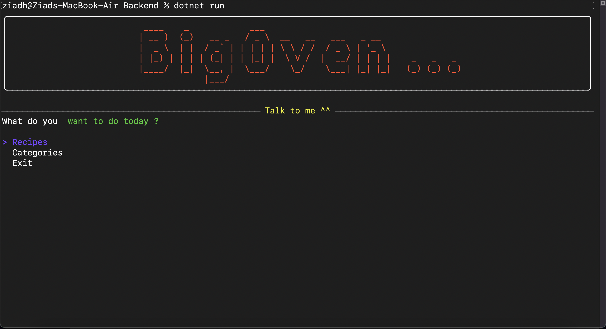
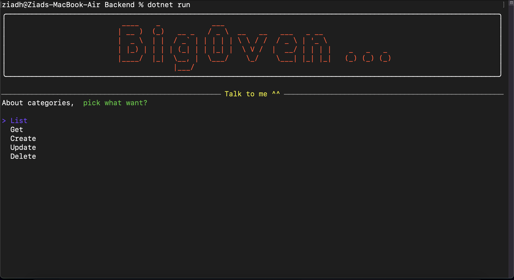
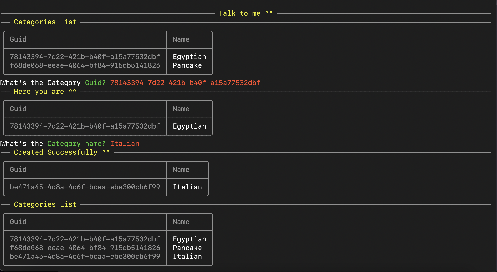

# 🫡 Welcome to BigOven Using .NET 🤖
This is my first project using C# and .NET, So this README.md will record all the learning steps I have been through.

# Goal 🤔
We are expecting in the near future to change from Json to a Database, and from Console to a RestAPI. For sure, we don't want to go through the whole codebase changing / reimplementing every line. So, the solution is to use:

```C#
// Dependency inversion from SOLID
var service = new Backend.Controller.Services.JsonService();
var controller = new Backend.Controller.Controller(service);
var viewService = new Backend.Views.Services.ConsoleService(controller);
var router = new Backend.Views.Router(viewService);

router.Run();
```

As you can see above, we can easily change JsonService() with DatabaseService() or ConsoleService(controller) with RestService(controller). It is called [Dependency inversion](https://youtu.be/S9awxA1wNNY). Also, I highly recommend this [anti-coupling-playlist](https://youtube.com/playlist?list=PLC0nd42SBTaNuP4iB4L6SJlMaHE71FG6N).


# Structure of BigOven:
```Console
ziadh@Ziads-MacBook-Air BigOven % tree -I obj -I bin
.
├── Backend
│   ├── Backend.csproj
│   ├── Categories.json
│   ├── Controller
│   │   ├── Controller.cs
│   │   └── Services
│   │       ├── IService.cs
│   │       └── JsonService.cs
│   ├── Exceptions
│   │   ├── CategoryNotFoundException.cs
│   │   └── RecipeNotFoundException.cs
│   ├── Models
│   │   ├── Category.cs
│   │   └── Recipe.cs
│   ├── Program.cs
│   └── Views
│       ├── Router.cs
│       └── Services
│           ├── ConsoleService.cs
│           ├── Davinci.cs
│           └── IViewService.cs
├── BigOven.sln
└── README.md

7 directories, 16 files
```

# Example





